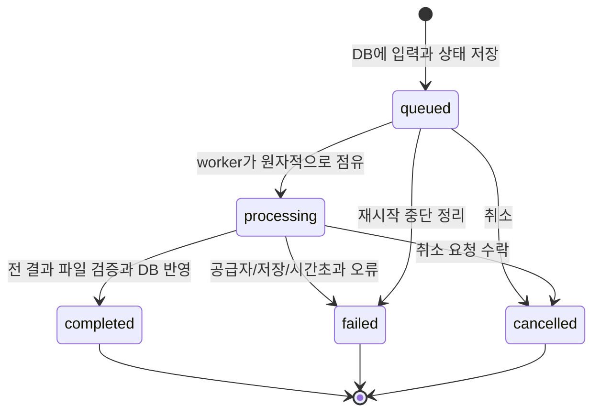

# Soundry 초기 설계

상태: **2026-09-30 사용자 전체 구현 승인, Phase 1–10 구현 및 CLI 실제 생성·20곡 제작 검증 완료**. 이 문서는 설계 결정을 설명하며 최신 실행 근거와 미수행 범위는 [출시 체크리스트](../quality/release-checklist.md)를 따른다. 아래 13개 결정은 첨부 기획 28항에 대응한다. 근거와 확인일은 [출처](../references/official-sources.md)에 있다.

## 1. 기술 스택

| 계층 | 선택 | 판단 |
|---|---|---|
| Runtime / 패키지 | Node.js 24 LTS ≥24.12, npm | 사용자 실행 목표와 현재 로컬 Node 24.15.0/npm 11.12.1에 부합 |
| Frontend | Vue 3 + TypeScript strict + Vite | Composition API/SFC, SPA만 사용 |
| UI | Tailwind CSS 4 + CSS 변수 | Vite plugin, 별도 UI kit 없이 studio 화면 구성 |
| Routing | Vue Router | dashboard/workspace/library 세 화면 |
| Backend | NestJS + TypeScript strict, 기본 Express adapter | controller는 검증·응답, service는 업무 처리 |
| DB | SQLite + Drizzle ORM + better-sqlite3 | 세 도메인 테이블에 SQL과 타입을 가까이 유지 |
| Audio | 단일 HTMLAudioElement | 기본 재생·탐색·볼륨을 충분히 제공 |
| HTTP / job | fetch, REST polling, in-process FIFO | 별도 broker·WebSocket·Redis 불필요 |
| 품질 도구 | ESLint, vue-tsc/tsc, Vitest, API 통합 테스트 | Phase 1에서 실제 동작하는 명령으로 고정 |

Prisma도 가능하지만 이번 설계는 로컬 SQLite 중심의 작은 schema와 명시적인 SQL migration 관리를 위해 Drizzle을 선택한다. 이는 프로젝트 판단이며 성능 우위를 주장하지 않는다. better-sqlite3는 native 모듈이므로 Phase 2에서 대상 Mac/Node의 설치·DB smoke test를 gate로 둔다. 문제 발생 시 임의로 ORM을 늘리지 않고 계획의 Decision Log에서 대안을 검토한다.

라이브러리의 정확한 patch와 상호 호환 버전은 Phase 1–2 설치 시 확인하고 단일 package-lock.json에 고정한다. 공식 예제에 RC가 있더라도 자동 채택하지 않고 stable 조합을 검증한다.

## 2. 디렉터리

다음은 **목표 구조**다. 구현 진행 상태는 Phase별 계획과 README에서 확인한다.

```text
Soundry/
  frontend/src/
    app/                 # router, shell, player mount
    features/
      projects/
      generation/
      tracks/
      library/
    audio/               # singleton audio controller + reactive state
    api/                 # fetch client
    components/          # 실제로 재사용하는 UI
    styles/
  backend/src/
    config/              # env, root paths, loopback
    database/            # schema, connection, migrations
    projects/
    generations/         # GenerationService, JobManager
    providers/           # contract, mock, 이후 선택한 adapter 하나
    tracks/
    storage/             # path, stream, staging, cleanup
  backend/migrations/
  backend/fixtures/audio/ # 자체 제작 mock WAV와 생성/권리 설명
  shared/contracts.ts     # JSON DTO 타입만; frontend/backend type-only import
  data/                   # 런타임 생성, gitignored
  harness/scripts/
  harness/templates/
  docs/
  package.json            # 두 workspace와 실행 명령
  package-lock.json
  .env.example
```

frontend/backend 두 npm workspace만 둔다. shared는 별도 배포 패키지로 만들지 않는다. 공통 DTO를 두 tsconfig에서 type-only로 소비하도록 Phase 1 build로 검증한다. backend class·Node 타입·ORM schema를 frontend로 가져오지 않는다.

## 3. Frontend 책임

Route view는 feature 컴포넌트를 조합한다. prompt/settings/submit은 generation composable, track 조작은 tracks composable, API 요청은 fetch client, 재생은 audio controller가 담당한다. business logic을 거대한 view 하나에 넣지 않는다.

서버를 project/generation/track의 기준 데이터로 둔다. 완료·수정 시 관련 목록을 다시 읽고, 요청 취소·route 변경 시 오래된 응답을 무시한다. pending job이 있는 동안만 2초 간격으로 현재 project의 generations를 조회한다. offline/network 오류는 job 실패와 구분하며 backoff 후 재조회한다. 새로고침은 서버 이력을 읽어 복원한다.

## 4. Backend 책임

- ProjectsService: CRUD와 project.updatedAt/trackCount 조회.
- GenerationsService: 입력 검증, immutable 입력 snapshot, retry/취소 요청.
- JobManager: 동시 실행 1개, 메모리 FIFO 대기열, AbortController와 실행 제한 시간.
- Provider adapter: 공급자별 기능·요청·응답·원격 polling을 내부에서 처리.
- TracksService: 조회·rename·favorite·삭제·원본 다운로드 metadata.
- StorageService: 안전한 상대 경로, stream 저장/읽기, temp→audio 이동, orphan 정리.
- DatabaseModule/ConfigModule: 연결과 migration, 설정·경로의 단일 소유자.

각 domain module 안에 필요한 service와 쿼리만 둔다. 범용 repository factory, CQRS, event bus, plugin registry는 만들지 않는다. 요청 DTO는 backend에서 runtime 검증하며 TypeScript 타입만 믿지 않는다.

## 5. SQLite 모델

Project → Generation → Track의 세 테이블을 사용한다. [필드·제약·삭제 일관성](data-model.md)을 기준으로 Phase 2 migration을 작성한다. Track의 projectId/prompt는 Generation join으로 API에 제공해 중복 저장을 줄인다. requested 설정과 provider가 실제로 반환한 metadata를 분리한다.

## 6. Provider 계약

[MusicGenerationProvider](provider.md)는 입력·capabilities·취소 signal·재생 가능한 결과 stream을 다룬다. UI/DB가 fal 전용 payload나 원격 URL에 의존하지 않도록 한다. MockProvider가 첫 구현이며 local model과 다른 API는 실제 선택될 때 adapter를 추가한다.

## 7. 로컬 저장

기본 root는 repository의 `data/`, `SOUNDRY_DATA_DIR` 지정 시 해당 위치다. 상대값은 backend 실행 cwd가 아니라 repository root 기준으로 resolve한다. bootstrap에서 한 번 절대 root를 계산하고 모든 service에 주입한다. 테스트·worktree는 서로 다른 임시 root를 사용한다.

```text
data/
  soundry.db
  audio/<track-uuid>.<verified-extension>
  temp/<generation-uuid>/<track-uuid>.part
  projects/  # 필요 시 프로젝트 부속 파일, 현재 메타데이터는 DB만
  exports/   # 향후 명시적 export용, MVP 다운로드는 원본 stream
```

MVP에서 불필요한 project JSON이나 export 복제본은 만들지 않는다. DB에는 `audio/...` 상대 경로만 저장한다. UUID 파일명을 사용하고 표시 제목은 filename/path의 원천이 아니다. 클라이언트는 track ID만 전달한다. 실제 path containment와 symlink 탈출을 검증한다.

음원은 제한된 크기로 temp에 streaming 저장하고 검증 후 동일 data filesystem 안에서 rename한다. DB·파일시스템은 단일 transaction이 아니므로 실패 보상과 재시작 정리를 [DB 문서](data-model.md)에 명시한다. 서버를 끈 뒤 data 전체를 복사하면 백업할 수 있다. 실행 중 DB 단일 파일 복사 방식은 안내하지 않는다.

## 8. Generation job 흐름



POST는 DB에 queued 저장 후 202와 generation ID를 반환한다. DB 기록 전에 접수 성공을 알리지 않는다. processing에도 재시작 시 failed 전이가 가능하며 `SERVER_RESTARTED`로 설명한다. 재시작 자동 재요청·유료 호출 복구는 MVP에서 하지 않는다.

대기열은 전체 최대 20개를 기본 상한으로 하고 초과는 429다. worker 동시성은 1이며 provider 내부 variations도 필요 시 순차 실행한다. UI 단계(preparing/generating/saving)는 transient 표시이고 provider가 퍼센트를 주지 않으면 숫자로 꾸미지 않는다.

완료와 취소는 Generation status를 조건으로 한 transaction으로 경쟁을 해결한다. 취소가 먼저 기록되면 늦게 도착한 결과를 저장하지 않고 정리한다. 완료가 먼저면 취소 요청은 terminal 상태를 반환한다. 원격 취소 성공이나 과금 중단은 별도 provider 능력이므로 보장하지 않는다.

MVP batch는 요청한 variations 전체가 검증되어야 completed다. 하나라도 실패하면 batch 전체 failed, staged 파일 정리, 부분 Track은 공개하지 않는다. retry/regenerate는 새 Generation으로 만든다. 오류 후 자동 유료 재시도는 없다. timeout은 Mock 작업 30초, CLI 작곡 호출 240초, 여러 variation의 작곡·합성을 포함한 CLI 작업 전체 20분으로 제한한다.

## 9. Audio playback

App shell에서 HTMLAudioElement 하나를 만든다. 모든 카드의 play 버튼은 같은 controller에 track ID를 전달한다. 전환 시 이전 source를 pause·정리하고 새 source를 설정한다. UI reactive state는 currentTrackId, playing, currentTime, duration, volume, error를 가진다.

play() 실패, ended, timeupdate, loadedmetadata, error 이벤트를 처리한다. play promise가 늦게 resolve되어 이전 곡 상태를 덮지 않도록 source/request token을 확인한다. 다운로드 URL과 재생 URL은 local API가 제공하며 생성 provider URL을 직접 쓰지 않는다. 서버는 Range/HEAD를 지원하고 큰 파일 전체를 브라우저 메모리에 적재하지 않는다.

duration을 알 수 없으면 빈 값으로 둔다. 수동 사용자 재생을 기본으로 해 autoplay 가정을 하지 않는다. waveform은 MVP 필수에서 제외한다.

## 10. API

[REST 계약](api.md)을 사용한다. `/api` 단일 prefix와 JSON 오류 형식을 사용하며 ID 기반 접근만 허용한다. 개발 UI의 `/api`는 Vite proxy로 backend에 전달한다. local API는 loopback 바인딩, Host/Origin 검증으로 브라우저의 불필요한 외부 호출을 차단한다.

## 11. 상태 관리

Vue `ref/reactive/computed`와 composable + app-level provide/inject로 시작한다. player는 singleton, job 목록은 서버 polling, form은 feature-local state다. Pinia, TanStack Query, localStorage DB는 초기 도입하지 않는다. 서버 데이터와 UI 상태의 구분이 어려워질 때만 계획에 이유를 기록하고 검토한다.

## 12. MVP 경계

[제품 범위](../product/product.md)에 정의한 CRUD·생성·비교·플레이어·즐겨찾기·원본 다운로드를 포함한다. Mock workflow는 외부 통신 없이 확인 가능해야 한다. 실제 AI는 Phase 8에서 기존 ChatGPT 로그인 기반 Codex CLI 작곡·로컬 합성으로 검증했으며 앱에 API 키를 입력하지 않는다. 검증 근거는 plan-013/014와 테스트 음원 제작 보고서를 따른다. local-first가 offline AI 추론을 뜻하지 않는다.

## 13. 구현 순서와 미확정 사항

[Phase 1–10 계획](../product/implementation-roadmap.md)의 gate를 순서대로 통과한다. 2026-09-30 Phase 1–10 구현 승인을 기록했으며 각 Phase 완료 gate를 지킨다.

2026-10-01 사용자가 유료 공급자를 제외하고 CLI 호출로 변경했다. 이전 Fal 구현은 미병합 상태로 보존하고 plan-013에서 Codex CLI의 JSON 악보 작곡과 자체 로컬 WAV 렌더링을 연결한다. 기존 로그인만 사용하며 유료 API fallback은 없다. 실제 생성·재생·다운로드 gate를 직접 검증한다.

## 14. 회원과 다중 행 편집 확장 — 2026-10-06

plan-017은 로컬 회원·서버 세션·등급·사용량, 랜딩/상품 페이지와 음원 클립 다중 행 편집을 추가한다. 이전 단일 사용자·로그인/멀티트랙 제외 결정은 이 범위에서 변경된다. Vue/Nest·loopback·로컬 DB/음원·기존 CLI 경계는 유지한다. 관리자도 소유 프로젝트만 접근하며 회원 관리 권한과 창작물 접근 권한을 구분한다.

비밀번호는 random 16-byte salt와 비동기 scrypt(N=32768,r=8,p=1,64-byte output)로 저장한다. 원문은 저장·로그에 남기지 않는다. 256-bit opaque token의 SHA256만 DB에 저장하며 HttpOnly/SameSite=Strict 쿠키, 7일 만료·로그아웃 폐기, 기존 Origin/Host 제한을 함께 사용한다. 서버 인증 요청은 분당 20개로 제한한다. 최초 가입 전은 기존 API의 호환 모드이며 화면은 회원 설정으로 이동한다. 최초 가입의 관리자 선정과 기존 프로젝트 인계는 단일 transaction이다. 원격 공개 서버로 배포하지 않는다.

사용량은 별도 영속 ledger이며 generation insert/update trigger로 예약·상태 변경을 반영한다. 접수의 동일 requestKey 확인과 quota 검사·insert는 한 IMMEDIATE transaction으로 실행한다. 실패/취소 복원과 삭제 후 사용량 보존을 DB에서 유지한다. 등급은 매 요청 DB 조회값을 사용한다.

편집 arrangement는 프로젝트에 JSON으로 저장하고 참조 Track의 소속·길이·범위·클립/행 수를 서버에서 검증한다. Web Audio의 local audio decode/scheduling으로 클립을 겹쳐 재생하며 반복·offset·gain을 반영한다. 미리듣기를 시작하면 기존 플레이어를 정지하고 기존 플레이어 재생 시 믹스를 정지한다. OfflineAudioContext에서 같은 클립을 렌더링해 PCM16 stereo WAV를 내보낸다. 음원 source 수/길이를 제한해 디코딩 메모리 사용을 제한한다.
